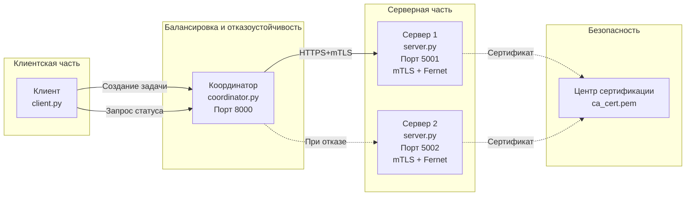

# Лабораторная работа №04. Реализация механизмов безопасности и отказоустойчивости в распределенной системе

---

**Студент:** Шокиров Егор

**Группа:** ЦИБ-241

**Вариант:** 21 (Отложенная обработка)

---

## 1. Цели и задачи работы

### Цель работы

Разработать и исследовать распределенную систему, обеспечивающую защищенную передачу данных с использованием взаимной аутентификации (mTLS) и симметричного шифрования, а также демонстрирующую отказоустойчивость через автоматическое переключение между узлами.

### Индивидуальное задание (Вариант 21)

**Отложенная обработка.** Сервер принимает задачу в очередь и возвращает уникальный идентификатор задачи (ID). Клиент периодически запрашивает статус выполнения задачи до её завершения.

---

## 2. Архитектура системы

### Схема архитектуры



---

## Компоненты системы

### 1. Клиент (client.py)

* Назначение: шифрует задачу ключом Fernet, отправляет её координатору, получает ID задачи и отслеживает статус выполнения.
* Порт: отсутствует.
* Протокол: HTTP → координатор.

### 2. Координатор (coordinator.py)

* Назначение: маршрутизация запросов и обеспечение отказоустойчивости.
* Порт: 8000.
* Протокол: HTTP → HTTPS + mTLS.

### 3. Сервер 1 (server.py)

* Назначение: принимает задачи, помещает их в очередь, выполняет обработку и хранит статусы.
* Порт: 5001.
* Протокол: HTTPS + mTLS.
* Роль: основной сервер.

### 4. Сервер 2 (server.py)

* Назначение: резервный сервер обработки задач.
* Порт: 5002.
* Протокол: HTTPS + mTLS.
* Роль: резервный сервер.

### 5. Центр сертификации (CA)

* Назначение: выпуск и подпись сертификатов.
* Файлы:

  * `ca_cert.pem`
  * `ca_key.pem`

### 6. Ключ Fernet

* Назначение: симметричное шифрование содержимого задачи.
* Файл: `encryption_key.txt`
* Алгоритм: AES-128-CBC + HMAC-SHA256.

---

## Инструкция по запуску

### 1. Установка зависимостей

```bash
pip install flask cryptography requests
```

### 2. Генерация сертификатов

```bash
chmod +x generate_certificates.sh
./generate_certificates.sh
```

### 3. Генерация ключа Fernet

```bash
python3 generate_key.py
```

### 4. Запуск компонентов

```bash
# Терминал 1
python3 server.py 5001

# Терминал 2
python3 server.py 5002

# Терминал 3
python3 coordinator.py

# Терминал 4
python3 client.py
```

---

## Демонстрация работы системы

### Скриншот 1: Запущенные серверы и координатор


Запущены Сервер 1 (порт 5001), Сервер 2 (порт 5002) и Координатор (порт 8000). Координатор принимает запросы клиента и перенаправляет их на доступный сервер.

---

### Скриншот 2: Создание задачи и отслеживание статуса


Клиент отправляет задачу на сервер через координатор. Сервер создаёт новую задачу, помещает её в очередь и возвращает уникальный идентификатор задачи. После этого клиент автоматически запрашивает статус выполнения до завершения обработки.

---

### Скриншот 3: Работа сервера


Сервер получает задание, сохраняет его в очереди задач и запускает обработку в отдельном потоке. После завершения статус задачи изменяется на `completed`.

---

### Скриншот 4: Демонстрация отказоустойчивости


Сервер 1 остановлен. Координатор обнаруживает ошибку подключения к основному серверу и автоматически перенаправляет запросы на резервный сервер (порт 5002). Обработка задачи продолжается без участия пользователя.

---

## Структура проекта


```text
lab_04/
│
├── server.py
├── coordinator.py
├── client.py
├── generate_key.py
├── generate_certificates.sh
├── encryption_key.txt
├── ca_cert.pem
├── ca_key.pem
├── client_cert.pem
├── client_key.pem
├── server_cert.pem
├── server_key.pem
└── requirements.txt
```

---

## Выводы

В ходе выполнения лабораторной работы:

1. **Настроена инфраструктура открытых ключей (PKI).** Созданы сертификаты X.509 для центра сертификации, серверов и клиента.

2. **Реализована защищённая передача данных.** Используются HTTPS-соединения с взаимной аутентификацией (mTLS) и дополнительное симметричное шифрование Fernet.

3. **Разработаны основные компоненты системы:**

   * `server.py` — обработка и хранение задач;
   * `client.py` — создание задач и отслеживание их статуса;
   * `coordinator.py` — маршрутизация запросов и обеспечение отказоустойчивости.

4. **Реализована отказоустойчивость.** При недоступности основного сервера координатор автоматически переключает запросы на резервный сервер.

5. **Выполнено индивидуальное задание (Вариант 21).** Реализован механизм отложенной обработки задач: сервер принимает задачу, помещает её в очередь, возвращает идентификатор задачи и позволяет клиенту отслеживать статус выполнения.

**Итог:** разработанная система обеспечивает безопасную передачу данных, отказоустойчивость, взаимную аутентификацию и поддержку асинхронной обработки задач с контролем состояния выполнения.

