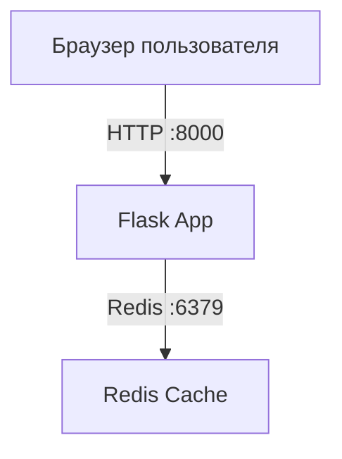

# Лабораторная работа №05

# Проектирование и реализация комплексной микросервисной системы с использованием Docker Compose

---

## Студент

**ФИО:** Шокиров Егор

**Группа:** ЦИБ-241

**Вариант:** 21

---

# Задание

Необходимо выполнить следующие изменения:

| Компонент          | Изменение                                                                 |
| ------------------ | ------------------------------------------------------------------------- |
| app.py             | Добавить HTML-футер «ООО Ромашка, 2024»                                   |
| docker-compose.yml | Переименовать сервис redis в cache (потребует правки app.py host='cache') |
| Dockerfile         | Сменить образ на python:alpine3.15                                        |

---

# Архитектура системы



---

# Цель работы

Получить практические навыки:

* запуска многоконтейнерных приложений;
* организации взаимодействия между сервисами;
* использования Docker Compose для оркестрации;
* изменения бизнес-логики и инфраструктуры проекта;
* работы с Redis как с внешним сервисом хранения данных.

---

# Выполнение работы

## Создание файла requirements.txt

Был создан файл `requirements.txt`, содержащий список зависимостей проекта:

```text
Flask==2.0.1
Werkzeug==2.0.3
redis==4.6.0
```

Файл используется Docker во время сборки образа для автоматической установки необходимых библиотек Python.

---

## Создание файла app.py

В файле `app.py` реализовано Flask-приложение, взаимодействующее с Redis.

Основные изменения для варианта 21:

* сервис Redis переименован в `cache`;
* адрес подключения изменен на `host='cache'`;
* добавлен HTML-футер с текстом «ООО Ромашка, 2024».

Приложение при каждом обращении пользователя к странице увеличивает значение счетчика посещений, которое хранится в Redis.

---

## Создание Dockerfile

Для сборки контейнера был создан файл `Dockerfile`.

В соответствии с вариантом был использован следующий базовый образ:

```dockerfile
FROM python:alpine3.15
```

Dockerfile выполняет следующие действия:

1. Загружает базовый образ Python.
2. Создает рабочую директорию контейнера.
3. Копирует файл зависимостей.
4. Устанавливает необходимые библиотеки.
5. Копирует файлы проекта.
6. Запускает приложение Flask.

---

## Создание docker-compose.yml

Для запуска нескольких контейнеров использован Docker Compose.

В рамках задания сервис Redis был переименован:

```yaml
cache:
  image: redis:alpine
```

Также контейнер веб-приложения был настроен на зависимость от сервиса `cache`:

```yaml
depends_on:
  - cache
```

Это обеспечивает корректный запуск контейнеров и их взаимодействие внутри общей сети Docker.

---

## Сборка и запуск проекта

После создания всех файлов проект был собран и запущен командой:

```bash
docker compose up -d --build
```

Далее была выполнена проверка списка контейнеров:

```bash
docker compose ps
```

### Скриншот 1. Результат выполнения команды docker compose ps

**Вставить скриншот здесь**

---

## Проверка работы приложения

После запуска контейнеров в браузере был открыт адрес:

```text
http://localhost:8000
```

На странице отображаются:

* название стенда;
* текущее количество посещений;
* футер «ООО Ромашка, 2024».

При каждом обновлении страницы счетчик автоматически увеличивается на единицу, поскольку его значение хранится в Redis.

### Скриншот 2. Работа приложения в браузере

**Вставить скриншот здесь**

---

## Проверка Redis

Для проверки данных в Redis было выполнено подключение к контейнеру:

```bash
docker compose exec cache redis-cli
```

Получение значения счетчика:

```bash
GET hits
```

В результате Redis возвращает текущее количество посещений страницы.

### Скриншот 3. Проверка значения счетчика в Redis

**Вставить скриншот здесь**

---

## Проверка логов приложения

Для просмотра логов использовалась команда:

```bash
docker compose logs web
```

Также была выполнена проверка логов в реальном времени:

```bash
docker compose logs -f web
```

В логах отображаются обращения пользователей к веб-приложению и ответы сервера.

### Скриншот 4. Логи веб-приложения

**Вставить скриншот здесь**

---

# Результаты работы

В ходе выполнения лабораторной работы было создано многоконтейнерное приложение, состоящее из веб-сервиса Flask и сервиса Redis. Контейнеры были объединены с помощью Docker Compose и взаимодействовали через внутреннюю сеть Docker.

В рамках индивидуального задания был добавлен HTML-футер с текстом «ООО Ромашка, 2024», выполнено переименование сервиса Redis в `cache`, а также произведена замена базового образа Docker на `python:alpine3.15`.

Все изменения были успешно протестированы. Приложение корректно запускается, отображает страницу в браузере, увеличивает счетчик посещений и сохраняет данные в Redis.

---

# Вывод

В результате выполнения лабораторной работы были получены практические навыки разработки и развертывания многоконтейнерных приложений с использованием Docker и Docker Compose. Было изучено взаимодействие сервисов внутри Docker-сети, освоены основные принципы работы Redis в качестве внешнего хранилища данных и рассмотрен процесс сборки пользовательских Docker-образов.

Также были закреплены навыки настройки инфраструктуры проекта, модификации бизнес-логики приложения и управления жизненным циклом контейнеров. Выполненное приложение полностью соответствует требованиям индивидуального варианта и демонстрирует работу микросервисной архитектуры на практике.

